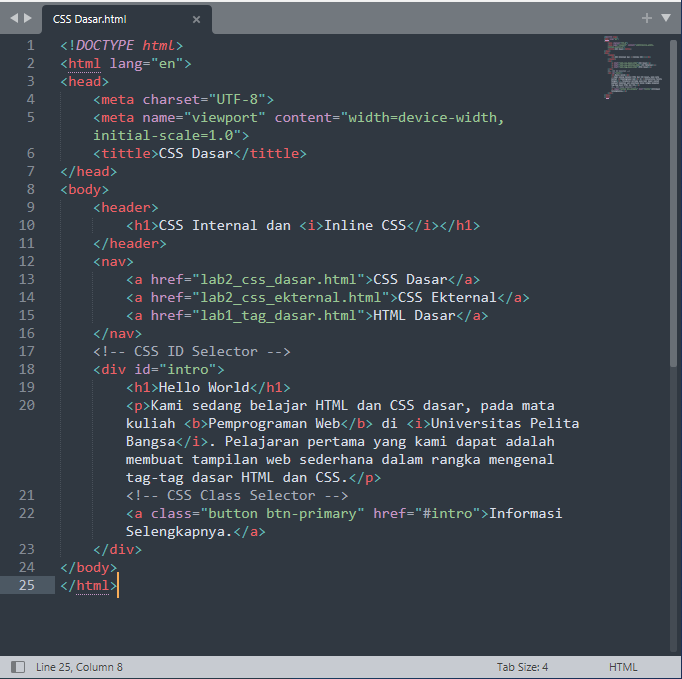
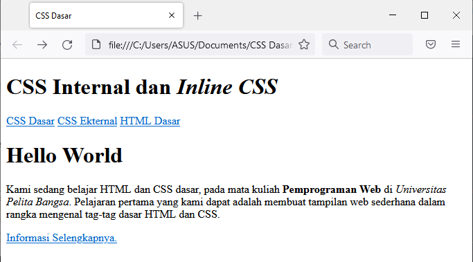
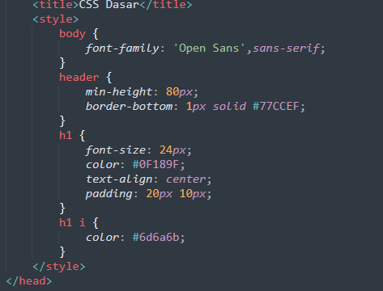
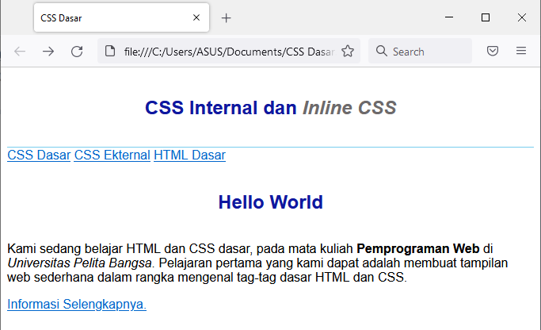

# Praktikum Pemprograman Web
Nama : Komarudin 

NIM  : 312010068 

Kelas : TI.20.D.1 

## Belajar Dasar CSS
### Langkah-Langkah Praktikum 

### 1. Membuat Dokumen HTML
Buatlah dokumen HTML,seperti berikut

  

Selanjutnya buka pada browser untuk melihat hasilnya. 

  

### 2. Mendeklarasikan CSS Internal

Kemudian tambahkan deklarasi CSS Internal seperti berikut pada bagian head dokumen.

  

Selanjutnya simpan perubahan yang ada,dan lakukan refresh pada browser untuk melihat hasilnya.

  

