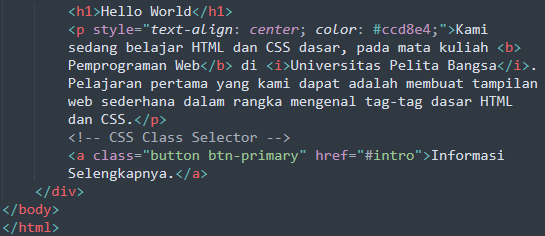
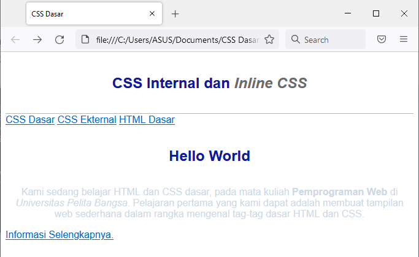
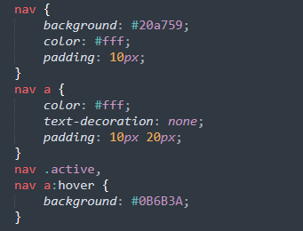
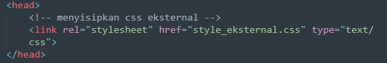
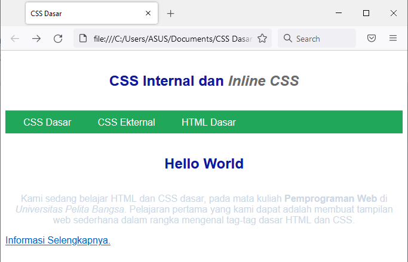
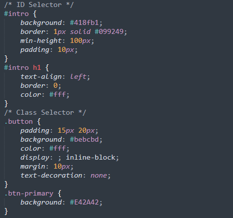
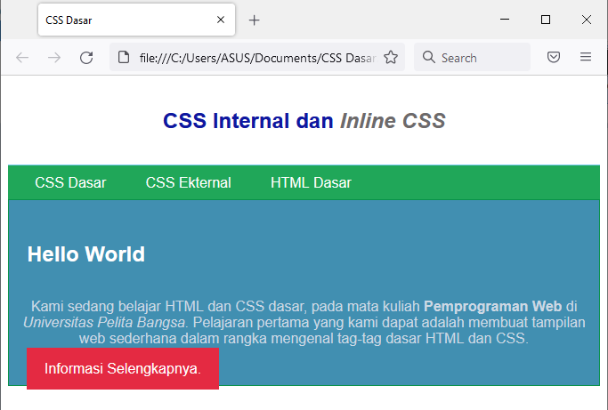
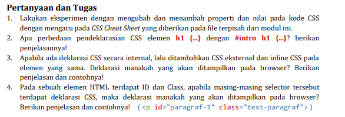

# Praktikum Pemprograman Web
<b> Nama : Komarudin 

    NIM  : 312010068 

    Kelas : TI.20.D.1</b> 

## Belajar Dasar CSS
### Langkah-Langkah Praktikum 

### 1. Membuat Dokumen HTML
Buatlah dokumen HTML,seperti berikut

  

Selanjutnya buka pada browser untuk melihat hasilnya. 

  

### 2. Mendeklarasikan CSS Internal

Kemudian tambahkan deklarasi CSS Internal seperti berikut pada bagian head dokumen.

  

Selanjutnya simpan perubahan yang ada,dan lakukan refresh pada browser untuk melihat hasilnya.

  

### 3. Menambahkan Inline CSS

Kemudian tambahkan deklarasi inline CSS pada tag 

  

Simpan kembali dan refresh kembali browser untuk melihat perubahannya.

  

### 4. Membuat CSS Eksternal

Buatlah file baru dengan nama <b>style_eksternal.css</b> kemudian deklarasikan CSS seperti berikut.

  

Kemudian tambahkan link untuk merujuk file CSS yang sudah dibuat pada bagian head

  

Selanjutnya refresh kembali browser untuk melihat perubahannya.

  

### 5. Menambahkan CSS Selector
Selanjutnya menambahkan CSS Selector menggunakan ID dan Class Selector. Pada file <b>style_eksternal.css</b>,tambahkan kode berikut.

  

Kemudian simpan kembali dan refresh browser untuk melihat perubahannya.

  

## Tugas Pertanyaan.<b>

## Jawaban :

2. Mendeklarasi {h1} = semua elemen {h1} akan berubah oleh CSS 

   Mendeklarasi (#intro h1) = hanya elemen h1 dengan deklarasi (#intro h1) saja yang berubah karena ID itu unik 
  
